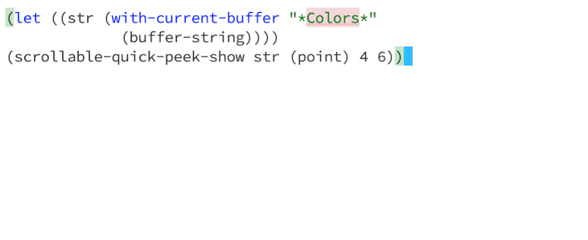

# scrollable-quick-peek


```emacs-lisp
;; This package adds the command `scrollable-quick-peek-show' which
;; extends `quick-peek-show' to allow for scrolling within the
;; quick-peek overlay.
;;
;; Up/Down arrows are the keys for scrolling
;;
;; <up>: `scrollable-quick-peek-scroll-up'
;; <down>: `scrollable-quick-peek-scroll-down'
;;
:: Any command other than those two will close the overlay.
;;
;; Other than that, is should behave in the same way as `quick-peek-show'.
;;
;; See M-x `customize-group' RET `quick-peek' for customisation.
```

## API

### `scrollable-quick-peek-show`

### Signature
(scrollable-quick-peek-show STR &optional POS MIN-H MAX-H)

### Documentation
Show STR in an inline scrollable window at POS.

MIN-H (default: 4) and MAX-H (default: 16) are passed directly to
quick-peek. quick-peek also accepts a 'none option for MIN-H
and MAX-H but these will not get passed given these don't make
sense for scrollale-quick-peek.

Key Bindings
This command is not in any keymaps.

### Example Usage

```emacs-lisp
(let ((str (with-current-buffer "*Colors*"
             (buffer-string))))
(scrollable-quick-peek-show str (point) 4 6))
```

## Install

Drop `scrollable-quick-peek.el` somewhere in your `load-path` and add
it to your `.emacs`:

```emacs-lisp
(add-to-list 'load-path "~/emacs.d/vendor")

(require 'scrollable-quick-peek)
```

## Screencast


## Credits

- https://github.com/cpitclaudel/quick-peek
- https://github.com/iqbalansari/emacs-source-peek
